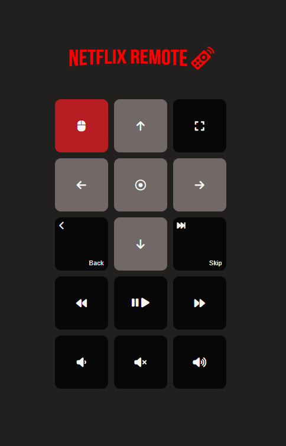

  
    
  

> Basic Netflix web remote control that can run anywhere

When you want to relax and eat your popcorn 🍿 while you watch your favorite movie or show, 
and you want to control your Netflix on your laptop or PC from your smartphone without installing a third party
app. Netflix remote is the way to go! 🚀.

Just install the app by clicking on one of these links

- [Mac OS](https://github.com/nmannaii/netflix-remote/releases/download/1.0.0/netflix-remote-v1.0.0-macos)
- [Linux](https://github.com/nmannaii/netflix-remote/releases/download/1.0.0/netflix-remote-v1.0.0-linux)
- [Windows](https://github.com/nmannaii/netflix-remote/releases/download/1.0.0/netflix-remote-v1.0.0-win.exe)

## App screenshot

  
    
  

## Maintainer
- [Najmedine Mannaii](https://github.com/nmannaii)

Enjoy!

